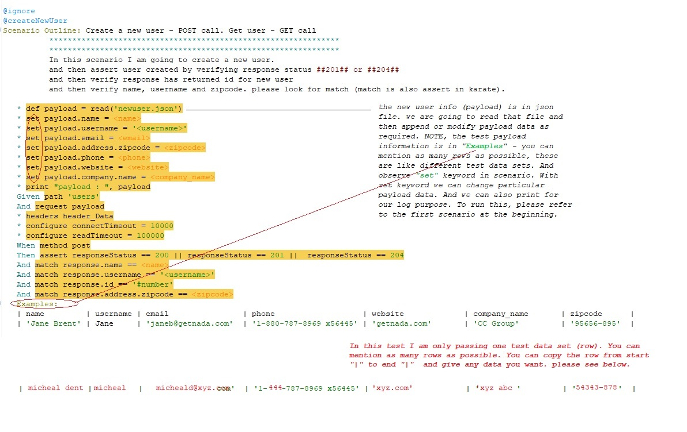

# moo-jsonplaceholder-qa

Test automation work built for testing restful api's using [Karate unified test automation framework](https://github.com/intuit/karate)

## QA Task


To complete the exercises below, please use this API [jsonplaceholder](https://jsonplaceholder.typicode.com/). There are more details on the resources available for this API in the [Readme](https://github.com/typicode/jsonplaceholder) here.


As a client of this [API](https://jsonplaceholder.typicode.com/users), I want to be able to:

 - Get a list of the following attributes about a user
<table>
 <tr><td>Name</td></tr>
 <tr><td>Username</td></tr>
 <tr><td>Email</td></tr>
 <tr><td>Phone</td></tr>
 <tr><td>Website</td></tr>
 </table>
 
 - Get a 404 status code when retrieving the details of an invalid user
 
 - Get a 200 status code when retrieving the details of a valid user
 
 - Create a new user
 
 - Delete a user
 
 - See the following fields in the header of a response when getting a list of users:
<table>
 <tr><td>Cache-Control => public</td></tr>
 <tr><td>Connection => keep-alive</td></tr>
 <tr><td>Content-Type => application/json</td></tr> 
</table>


Further checks:

1. Please write automated checks that cover these scenarios
2. Please write two additional pieces of acceptance criteria that describe other behaviours of the API, and implement checks for those as well
3. Please write a ReadMe for your test framework - the reviewer of your code should be able to run the tests you write using only the ReadMe


# Getting Started
This work requires [Java](http://www.oracle.com/technetwork/java/javase/downloads/index.html) 8 (at least version 1.8.0_112 or greater) and then either [Maven](http://maven.apache.org) or [Eclipse](#eclipse-quickstart) to be installed.

## Maven

So you need following `<dependencies>`: Or you simply [click](https://github.com/meharlist/moo-jsonplaceholder-qa/blob/master/pom.xml) here

```xml
	    <dependency>
            <groupId>com.intuit.karate</groupId>
            <artifactId>karate-junit4</artifactId>
            <version>${project.version}</version>
            <scope>test</scope>
        </dependency>
        <dependency>
            <groupId>com.intuit.karate</groupId>
            <artifactId>karate-apache</artifactId>
            <version>${project.version}</version>
            <scope>test</scope>
        </dependency>         
                    
        <dependency>
            <groupId>net.masterthought</groupId>
            <artifactId>cucumber-reporting</artifactId>
            <version>3.8.0</version>
            <scope>test</scope>
        </dependency>
```


### Quickstart
It may be easier for you to use the Karate Maven archetype to create a skeleton project with one command.

> If you are behind a corporate proxy, follow this Karate [link](https://github.com/intuit/karate#quickstart)

You can replace the values of `com.mycompany` and `myproject` as per your needs.

```
mvn archetype:generate \
-DarchetypeGroupId=com.intuit.karate \
-DarchetypeArtifactId=karate-archetype \
-DarchetypeVersion=0.8.0 \
-DgroupId=com.mycompany \
-DartifactId=myproject
```

This will create a folder called `myproject` (or whatever you set the name to).


:point_right: #### Now we get in to the real work.

### Maven commands to run this project

> **mvn clean package compiler:testCompile surefire:test**
If you just want to run this project, please make sure to put or append **#** before ignore tag as shown below. I request to use just one scenario for dry run.


> **Report** - to see reports (cucumber html output and maven json files), please open target folder in your project.

:point_right: #### Now I want to show all the scenarios, if you want to execute all scenarios after this, please append "#" before **ignore** tag.

> I will first put all the karate bdd scenarios - covers **(GET, POST, DELETE)** scenarios. You should find the **project structure** down the road of this work.
If you want to see the feature file that has all the scenarios [click](https://github.com/meharlist/moo-jsonplaceholder-qa/blob/master/src/test/java/moo/users/users.feature) here.


### Test scenario one: GET user


> This below image is same as above, but only with extra stuff to inform - How to execute and what things to take before running maven command.


### Test scenario two: Create new user - POST


> This below image is same as above, but only with extra stuff to inform


> Before we create new user using **(POST)** , we read data (newUser.json) and modify payload. The required data comes from examples as shown above.
To see payload file [click](https://github.com/meharlist/moo-jsonplaceholder-qa/blob/master/src/test/java/moo/users/newUser.json) here.


### Test scenario three: GET invalid user


### Test scenario four: DELETE user 


### Project Structure


> In the next image you will witness the **Configuration file** and Karate keyword **Background** in feature file
To see **Configuration file** in this project, [click](https://github.com/meharlist/moo-jsonplaceholder-qa/blob/master/src/test/java/karate-config.js) here, and to witness or understand **Background** [click](https://github.com/meharlist/moo-jsonplaceholder-qa/blob/master/src/test/java/moo/users/users.feature) here.


> If you are familiar with Cucumber, the big difference(cucumber-vs-karate) here is that you **don't** need to write extra "glue" code or Java "step definitions" !

:thumbsup: **Good Luck with [Karate](https://github.com/intuit/karate#quickstart)**