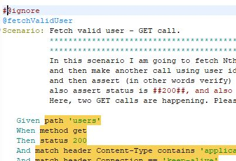
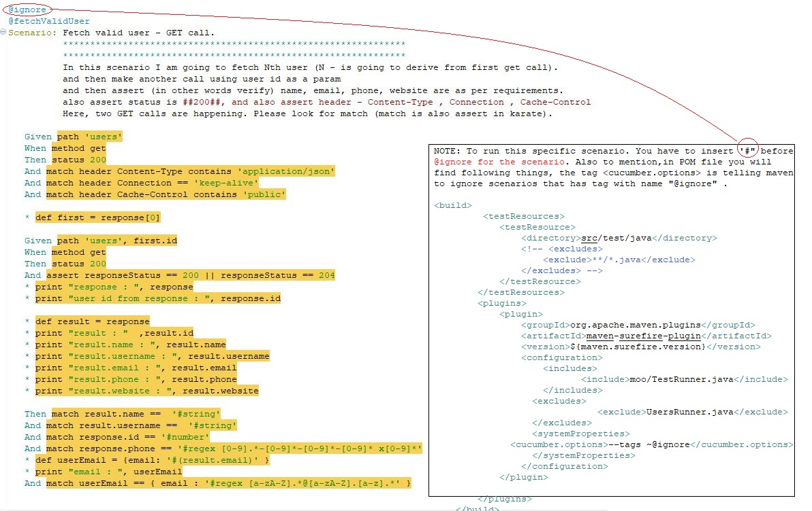

# moo-jsonplaceholder-qa

Test automation work built for testing restful api's using [Karate unified test automation framework](https://github.com/intuit/karate)

## QA Task


To complete the exercises below, please use this API [jsonplaceholder](https://jsonplaceholder.typicode.com/). There are more details on the resources available for this API in the [Readme](https://github.com/typicode/jsonplaceholder) here.


As a client of this [API](https://jsonplaceholder.typicode.com/users), I want to be able to:

 - Get a list of the following attributes about a user
<table>
 <tr><td>Name</td></tr>
 <tr><td>Username</td></tr>
 <tr><td>Email</td></tr>
 <tr><td>Phone</td></tr>
 <tr><td>Website</td></tr>
 </table>
 
 - Get a 404 status code when retrieving the details of an invalid user
 
 - Get a 200 status code when retrieving the details of a valid user
 
 - Create a new user
 
 - Delete a user
 
 - See the following fields in the header of a response when getting a list of users:
<table>
 <tr><td>Cache-Control => public</td></tr>
 <tr><td>Connection => keep-alive</td></tr>
 <tr><td>Content-Type => application/json</td></tr> 
</table>


Further checks:

1. Please write automated checks that cover these scenarios
2. Please write two additional pieces of acceptance criteria that describe other behaviours of the API, and implement checks for those as well
3. Please write a ReadMe for your test framework - the reviewer of your code should be able to run the tests you write using only the ReadMe


# Getting Started
This work requires [Java](http://www.oracle.com/technetwork/java/javase/downloads/index.html) 8 (at least version 1.8.0_112 or greater) and then either [Maven](http://maven.apache.org) or [Eclipse](#eclipse-quickstart) to be installed.

## Maven

So you need following `<dependencies>`: Or you simply [click](https://github.com/meharlist/moo-jsonplaceholder-qa/blob/master/pom.xml) here

```xml
	    <dependency>
            <groupId>com.intuit.karate</groupId>
            <artifactId>karate-junit4</artifactId>
            <version>${project.version}</version>
            <scope>test</scope>
        </dependency>
        <dependency>
            <groupId>com.intuit.karate</groupId>
            <artifactId>karate-apache</artifactId>
            <version>${project.version}</version>
            <scope>test</scope>
        </dependency>         
                    
        <dependency>
            <groupId>net.masterthought</groupId>
            <artifactId>cucumber-reporting</artifactId>
            <version>3.8.0</version>
            <scope>test</scope>
        </dependency>
```


### Quickstart
It may be easier for you to use the Karate Maven archetype to create a skeleton project with one command.

> If you are behind a corporate proxy, follow this Karate [link](https://github.com/intuit/karate#quickstart)

You can replace the values of `com.mycompany` and `myproject` as per your needs.

```
mvn archetype:generate \
-DarchetypeGroupId=com.intuit.karate \
-DarchetypeArtifactId=karate-archetype \
-DarchetypeVersion=0.8.0 \
-DgroupId=com.mycompany \
-DartifactId=myproject
```

This will create a folder called `myproject` (or whatever you set the name to).


:point_right: **Now we get in to the real work.**


### Maven command to run this project
```
mvn clean package compiler:testCompile surefire:test
```

If you just want to run this project, please make sure to put or append **#** before ignore tag as shown below. I request anyone to use just one scenario for dry run.



> **Report** - to see reports (cucumber html output and maven json files), please open target folder in your project.


:point_right: **Now I want to show all the scenarios, if you want to execute all scenarios after this, please append "#" before **ignore** tag.**

> I will first put all the karate bdd scenarios - covers **(GET, POST, DELETE)** scenarios. You should find the **project structure** down the road of this work.
If you want to see the feature file that has all the scenarios [click](https://github.com/meharlist/moo-jsonplaceholder-qa/blob/master/src/test/java/moo/users/users.feature) here.


### Test scenario one: GET user


> This below image is same as above, but only with extra stuff to inform - How to execute and what things to take before running maven command.



### Test scenario two: Create new user - POST


> This below image is same as above, but only with extra stuff to inform


> Before we create new user using **(POST)** , we read data (newUser.json) and modify payload. The required data comes from examples as shown above.
To see payload file [click](https://github.com/meharlist/moo-jsonplaceholder-qa/blob/master/src/test/java/moo/users/newUser.json) here.


### Test scenario three: GET invalid user


### Test scenario four: DELETE user 


### Project Structure


> In the next image you will witness the **Configuration file** and Karate keyword **Background** in feature file
To see **Configuration file** in this project, [click](https://github.com/meharlist/moo-jsonplaceholder-qa/blob/master/src/test/java/karate-config.js) here, and to witness or understand **Background** [click](https://github.com/meharlist/moo-jsonplaceholder-qa/blob/master/src/test/java/moo/users/users.feature) here.


### Reports/Output

> Karate with the help of cucumber api generates default html reports. Note: maven surefire plugin (api) creates json files and those files will be used by cucumber to generate reports.


> 


>


> If you are familiar with Cucumber, the big difference(cucumber-vs-karate) here is that you **don't** need to write extra "glue" code or Java "step definitions" !


### My answers or argument for the questions asked in test.


1. Why I choose Karate for API testing?
  
   ``` 
   It is the best project or framework out there and most used **GIT** project in the market. 
   It is pretty easy - no extra clutter - no forming dynamic url's, no extra code to generate 
   beautiful report, no extra code to log input/output, very easy to understand, while all these 
   things need extra time if i were to use **RestAssured** or any other tools or frameworks or
   api's to test **Webservices**.
   
   Karate also helps me to easily test soap services as well. Karate syntax is very similar or 
   most times the same format for both **SOAP** and **Restful**.
   
   With minimal java or javascript expeience you can run Karate tests.
   ```
   
2. What questions I would ask my product manager?
   
   ```
   I don't have any further questions to ask. My aim is always to understand requirements, gather 
   as much information as possible, ask questions, give answers, and conclude my objective to deliver. 
   
   Just to add further, these are pretty straight forward api's to test using any tool or framework 
   (ex: Karate, restassured along with Junit or TestNG). If my api test requires to reuse a particular 
   value from prior api test (output) then, I have to think about data storage, basically I save 
   required value in variable and then save it in some data store (may be I would write extra java code
   to save it in csv or sqlllite), and I would fetch the particular value for the consecutive api tests.
   Note: Such value or variable reusability handling is little different or I may not use any datastore 
   if I were to use RestAssured with JUnit or TestNG. But there is a cost - time factor - time to write 
   api test in karate is much easier, faster and easy to maintain compared to any other tool. 
   Finally, in my experience it is little daunting or challenging task for manual tester (qa) to make use 
   of code written in Java, be it **Restassured** or **SAAJ**. Karate makes my life easy, because I had to
   make sure framework is ready or coded as early as possible and let others in the team use it. 
   ```

3. Why did I choose to structure my code in the way it is?

   ```
   To repeat, these are really easy api's tests. If I were to test complex scenarios, such as - reusing
   data from previous output, then I would be also including extra maven project with small light weight
   database or csv datastore, this will help me to apply dependency in test project and save reusable values.
   
   Adding to the above, if i were to test multiple api's covering different business requirements (or different
   work flows) then I will be maintaining different packages for specific work flows.
   
   Next, If i were to run only particular feature files then I would be maintaining a specific parent folder under
   (src\test\java) where it will hold only one feature file having or calling other feature files (only the required ones).   
   ```

4. What is my approach to start testing on a given project or task?

  ```
  Ask as many questions as possible, know things you are not aware, try to figure out challenges in the early stage of product
  development, be involved, show good support to stakeholders - dev, qa, BA's, product manager and etc -, maintain good 
  communication and presentation at every level.
  ```
  
:thumbsup: **Good Luck with [Karate](https://github.com/intuit/karate#quickstart)**